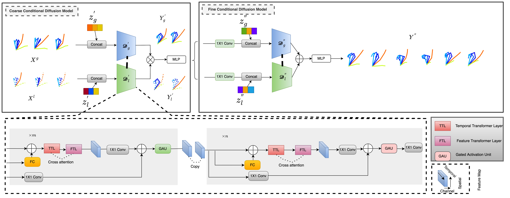

<div align="center">
<h1> Capturing Hand Dynamics: A Dual-diffusion Network for Accurate Hand Pose Prediction </h1>
<h3>Zhifeng Wang, Kaihao Zhang, Ramesh Sankaranarayana
</h3>
College of Engineering and Computer Science, Australian National University, Canberra, ACT, Australia.   (Email: zhifeng.wang@anu.edu.au; super.khzhang@gmail.com; ramesh.sankaranarayana@anu.edu.au)
</div>

<div align="center"> <h3> Abstract </h3>  </div>
<div align="justify">

Forecasting hand poses presents a formidable challenge due to 
factors such as uncertainty, obstructed views, and input 
perturbations stemming from imprecise 3D pose estimations. 
Recent progress in the field of diffusion models holds potential 
for generating accurate 3D hand poses even in the presence of 
noisy input data. In this paper, we propose a novel framework 
called dual-diffusion for accurate hand pose forecasting. 
Our framework leverages the capabilities of diffusion models
and formulates hand pose forecasting as a reverse diffusion process, 
addressing the challenges of capturing subtle joint displacements. 
In order to augment the acquisition of hand pose representations, 
we introduce an innovative neural network structure capable of 
concurrently acquiring both local and global representations. T
he architecture consists of Global and Local Diffusion (GLD) blocks,
which facilitate the diffusion of information between the local and 
global features. This diffusion-based interaction enables the
integration of global hand actions and local finger actions,
leading to a more powerful representation learning approach. 
We evaluate the effectiveness of our Dual-diffusion method
through comprehensive analyses conducted on three prevalent 3D hand 
pose estimation datasets (MSRA, F-PHAB, and BigHand2.2M). 
The results underscore the superiority of our
approach in accurately forecasting 3D hand postures 
compared to previous methods.

</br>
<div>
The Dual-diffusion paradigm introduced in this study embodies a distinctive neural network architecture designed to concurrently acquire both local
and global representations. This architectural configuration incorporates Global and Local Diffusion (GLD) blocks, strategically engineered to enable the
seamless diffusion of information between localized and overarching features.
</div>


##Getting started

## Requirements
The code requires Python 3.9 or later. The file [requirements.txt](requirements.txt) contains the full list of required Python modules.
```
pip install -r requirements.txt
```

## Data
[MSRA](https://www.dropbox.com/s/c91xvevra867m6t/cvpr15_MSRAHandGestureDB.zip?dl=0) in 3d position can be downloaded from [here](https://www.dropbox.com/s/c91xvevra867m6t/cvpr15_MSRAHandGestureDB.zip?dl=0).

Directory structure: 
```
msra
|-- P0
|-- P1
|-- P2
|-- ...
|-- P8
```
[F-PHAB](https://guiggh.github.io/publications/first-person-hands/) from their official websites [here](https://guiggh.github.io/publications/first-person-hands/).

[BigHand2.2M](https://openaccess.thecvf.com/content_cvpr_2017/papers/Yuan_BigHand2.2M_Benchmark_Hand_CVPR_2017_paper.pdf) from their official websites [here](https://openaccess.thecvf.com/content_cvpr_2017/papers/Yuan_BigHand2.2M_Benchmark_Hand_CVPR_2017_paper.pdf).


Specify the data path with ```data_dir``` argument.

# Training and Testing

## MSRA
You need to train a short-term and long-term model using these commands:
```bash
python main_gl_3d_msra_new.py --mode train --epochs 50 --data all --joints 21 --input_n 10 --output_n 5 --data_dir './' --output_dir model_s_msra
```

```bash
python main_gl_3d_msra_new.py --mode train --epochs 50 --data all --joints 21 --input_n 15 --output_n 25 --data_dir './' --output_dir model_l_msra
```

For evaluating the DualDiffusion model you can run the following command. Specify the short-term and long-term model checkpoints directory with ```--model_s``` and ```--model_l``` arguments.

```bash
python main_gl_3d_msra_new.py --mode test --data all --joints 21 --input_n 10 --output_n 25 --data_dir './'  --model_s model_s_msra --model_l model_l_msra --output_dir model_l_msra
```


## F-PHAB and BigHand2.2M
You need to train a short-term and long-term model using these commands:
```bash
python main_gl_3d_fphab_new.py --mode train --epochs 50 --data all --joints 21 --input_n 10 --output_n 5 --data_dir './' --output_dir model_s_msra
```

```bash
python main_gl_3d_fphab_new.py--mode train --epochs 50 --data all --joints 21 --input_n 15 --output_n 25 --data_dir './' --output_dir model_l_msra
```

For evaluating the DualDiffusion model you can run the following command. Specify the short-term and long-term model checkpoints directory with ```--model_s``` and ```--model_l``` arguments.

```bash
python main_gl_3d_fphab_new.py --mode test --data all --joints 21 --input_n 10 --output_n 25 --data_dir './'  --model_s model_s_msra --model_l model_l_msra --output_dir model_l_msra
```


# Acknowledgments

The overall code framework (dataloading, training, testing etc.) was adapted from [HRIS](https://github.com/wei-mao-2019/HisRepItself).

[//]: # (The base of the diffusion was borrowed from [CSDI]&#40;https://github.com/ermongroup/CSDI&#41;.)

[//]: # (## Citation)

[//]: # ()
[//]: # (```)

[//]: # (@INPROCEEDINGS{saadatnejad2023diffusion,)

[//]: # (  author = {Saeed Saadatnejad and Ali Rasekh and Mohammadreza Mofayezi and Yasamin Medghalchi and Sara Rajabzadeh and Taylor Mordan and Alexandre Alahi},)

[//]: # (  title = {A generic diffusion-based approach for 3D human pose prediction in the wild},)

[//]: # (  booktitle={International Conference on Robotics and Automation &#40;ICRA&#41;}, )

[//]: # (  year  = {2023})

[//]: # (})

[//]: # (```)

[//]: # (## License)

[//]: # (AGPL-3.0 license)